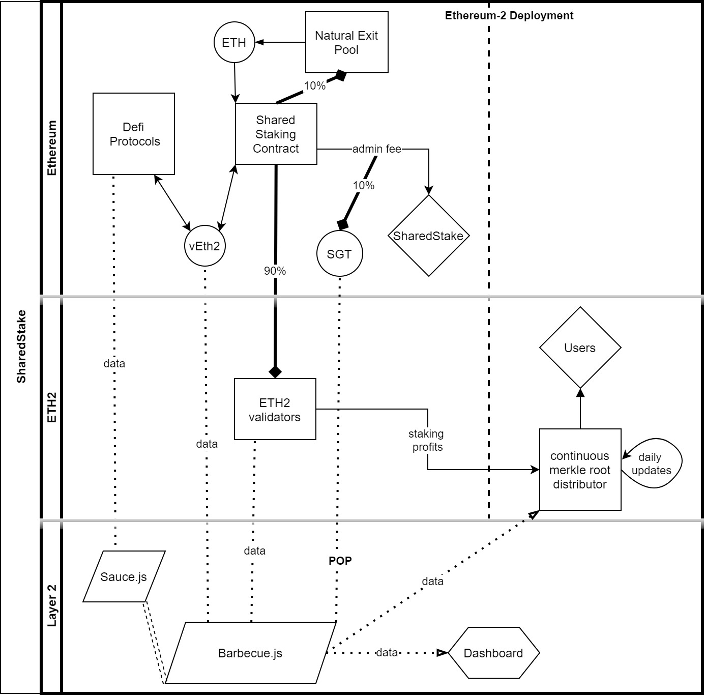

# Barbecue
## What is Barbecue
Barbecue is the main data aggregator built on top of Blockchain data. It collects all the data that is needed for the SharedStake Dashboard.

Main purpose of this implementation is creating a calculator for SharedStake's Profit Sharing mechanism. A user's Profit is calculated by time*amount that is collected from vEth2 token, representative stable token for every staked Ether. This is a lightweight implementation that handles everything needed.
 

## Implementation 
Apart from the general stats, Barbecue consist of 2 main parts: 
- Eth1 calculator that collects users data
- Eth2 calculator that collects the data from Eth2, to calculate the total gain.

Implementation is stateless, which means it doesn't need any previous data to run. However, we use some stored data, to make it faster.

Implementation doesn't include the Sauce.js, which is a collection of adaptors to distribute the profits further. It calculates and distributes the profits made by defi protocols through vEth2. Which means you can use your vEth2 to get more profits on any Eth pool in all defi.

## Develop 

Get an atlas account and signup to use mongodb,
Get a key from infura,
Then create a *config.env* file that looks like this:

NODE_ENV=development
PORT=5000
USER=icebear
DATABASE=mongodb+srv://icebear:<PASSWORD>@icebear.lokpg.mongodb.net/barbecue?retryWrites=true&w=majority
DATABASE_PASSWORD=****

INFURA=****

To start the implementation:
```
npm install
npm run dev
```